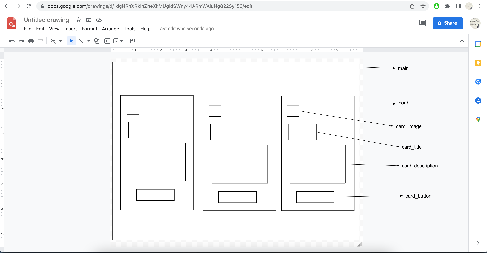
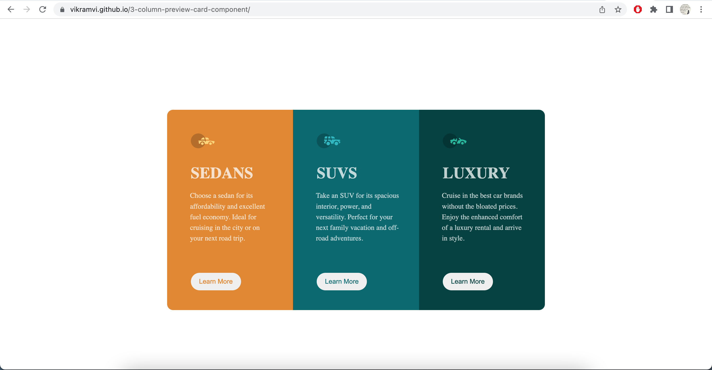
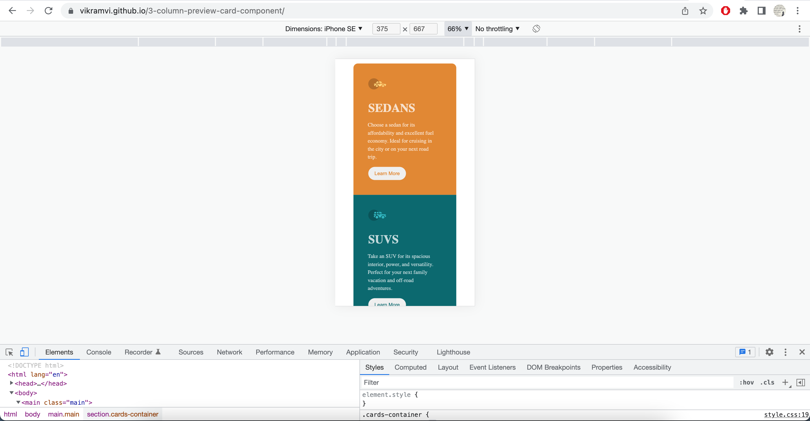

# Frontend Mentor - 3-column preview card component solution

This is a solution to the [3-column preview card component challenge on Frontend Mentor](https://www.frontendmentor.io/challenges/3column-preview-card-component-pH92eAR2-). Frontend Mentor challenges help you improve your coding skills by building realistic projects.

## Table of contents

- [Overview](#overview)
  - [The challenge](#the-challenge)
  - [Screenshot](#screenshot)
  - [Links](#links)
- [My process](#my-process)
  - [Built with](#built-with)
  - [What I learned](#what-i-learned)
  - [Continued development](#continued-development)
  - [Useful resources](#useful-resources)
- [Author](#author)
- [Acknowledgments](#acknowledgments)

## Overview

This is 5th project from "Frontend Mentor" to sharpen HTML & CSS skills along with responsive web design and it's build with BEM and Grid layout 1st time.

### The challenge

Learnt BEM and Grid Layout first and later implemented first time in a project.

### Screenshot

### Links

- [Solution URL ](https://vikramvi.github.io/3-column-preview-card-component/)

## My process

- Use Google drawing to draw boxes as per design
- Add BEM class names against each of the boxes
- Create HTML -> add BEM class names
- Mobile screen styling first
- Use media query to design for desktop

### Built with

- Semantic HTML5 markup
- BEM
- CSS
- Grid
- Mobile First workflow

### Useful resources

- Check Acknowledgments section

## Author

- Frontend Mentor - [@vikramvi](https://www.frontendmentor.io/profile/vikramvi)

## Acknowledgments

Kevin Powell

- [Learn CSS Grid the easy way](https://www.youtube.com/watch?v=rg7Fvvl3taU&t=22s&ab_channel=KevinPowell)
- [Make CSS Grid soooo much easier to understand and use](https://www.youtube.com/watch?v=m04RkJwzFgE&list=PL4-IK0AVhVjM41-Ezm5tmESVchNEi7aZU&index=3&t=153s&ab_channel=KevinPowell)
- [GH Repo](https://github.com/kevin-powell/learn-grid-the-easy-way)

BEM References

- https://github.com/annaindistress/frontend-mentor-stats-preview-card-component
  - https://www.frontendmentor.io/solutions/stats-preview-card-component-postcss-ry7pkJvLq
- https://github.com/jaycgreenwald/stats-preview-card-component
  - https://www.frontendmentor.io/solutions/statspreviewcardcomponent-H1YSRb_Uc

Mobile First Approach

- https://www.frontendmentor.io/solutions/mobile-first-css-grid-stat-preview-card-component-rkwwkZOL5
  - https://github.com/serhii-maliutin/stats-preview-card-component

BEM Documentation

- http://getbem.com/introduction/
- http://getbem.com/naming/
